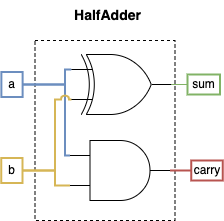
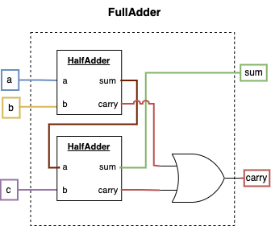
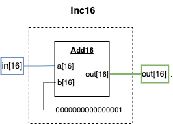
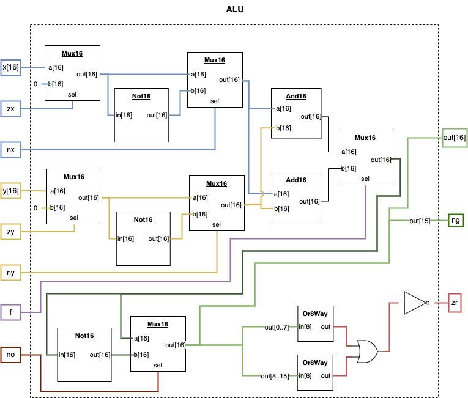

[Back](../../README.md)

# Course 1 Project 2

Building the chips that lead to and include the ALU (Arithmetic Logic Unit).

## HalfAdder

Capable of adding 2 bits together to produce a sum and a carry bit.

### Truth Table

| a   | b   | sum | carry |
| --- | --- | --- | ----- |
| 0   | 0   | 0   | 0     |
| 0   | 1   | 1   | 0     |
| 1   | 0   | 1   | 0     |
| 1   | 1   | 0   | 1     |

### Diagram

The sum and carry columns of the truth table above exactly match the truth table output of the `Xor` and `And` gate respectively, so we can simply reuse them for the diagram.

## FullAdder

Capable of adding 3 bits together (2 inputs and a carry) and outputs a sum and a carry bit

### Truth Table

| a   | b   | c   | sum | carry |
| --- | --- | --- | --- | ----- |
| 0   | 0   | 0   | 0   | 0     |
| 0   | 0   | 1   | 1   | 0     |
| 0   | 1   | 0   | 1   | 0     |
| 0   | 1   | 1   | 0   | 1     |
| 1   | 0   | 0   | 1   | 0     |
| 1   | 0   | 1   | 0   | 1     |
| 1   | 1   | 0   | 0   | 1     |
| 1   | 1   | 1   | 1   | 1     |

### Diagram

Uses 2 half adder gates chained together to produce the sum output, and then enables the carry bit if either of the half adder carry bits produced a carry.

## Add16

Capable of adding 2 16-bit inputs together. The final carry bit is ignored and only the sum is kept.

### Diagram

For this diagram, the first sum is calculated using a HalfAdder, but all additional bits are calculated using a chain of FullAdders that pass their carry bit to the next adder.

## Inc16

Increments a 16-bit input by 1.

### Diagram

For this diagram we simply pass the value `1` as the second input to an `Add16` gate.

## ALU - Arithmetic Logic Unit

The ALU receives 2 16-bit inputs and 6 control bits and manipulates the inputs to produce a single 16-bit output along with 2 addition information bits.

### Control Bits Explained

| Label | Purpose                                                                                                          |
| ----- | ---------------------------------------------------------------------------------------------------------------- |
| zx    | Sets the x input value to zero if enabled                                                                        |
| nx    | Inverts the outcome of the `zx` evaluation (Not x) if enabled                                                    |
| zy    | Sets the y input value to zero if enabled                                                                        |
| ny    | Inverts the outcome of the `ny` evaluation (Not y) if enabled                                                    |
| f     | Selects the function use for the outcome of the `nx` and `ny` evaluations. If `f == 1` then `x + y` else `x & y` |
| no    | Inverts the outcome of the `f` (function) evaluation if enabled                                                  |

### All Possible Binary Operations

| zx  | nx  | zy  | ny  | f   | no  | output |
| --- | --- | --- | --- | --- | --- | ------ |
| 1   | 0   | 1   | 0   | 1   | 0   | `0`    |
| 1   | 1   | 1   | 1   | 1   | 1   | `1`    |
| 1   | 1   | 1   | 0   | 1   | 0   | `-1`   |
| 0   | 0   | 1   | 1   | 0   | 0   | `x`    |
| 1   | 1   | 0   | 0   | 0   | 0   | `y`    |
| 0   | 0   | 1   | 1   | 0   | 1   | `!x`   |
| 1   | 1   | 0   | 0   | 0   | 1   | `!y`   |
| 0   | 0   | 1   | 1   | 1   | 1   | `-x`   |
| 1   | 1   | 0   | 0   | 1   | 1   | `-y`   |
| 0   | 1   | 1   | 1   | 1   | 1   | `x+1`  |
| 1   | 1   | 0   | 1   | 1   | 1   | `y+1`  |
| 0   | 0   | 1   | 1   | 1   | 0   | `x-1`  |
| 1   | 1   | 0   | 0   | 1   | 0   | `y-1`  |
| 0   | 0   | 0   | 0   | 1   | 0   | `x+y`  |
| 0   | 1   | 0   | 0   | 1   | 1   | `x-y`  |
| 0   | 0   | 0   | 1   | 1   | 1   | `y-x`  |
| 0   | 0   | 0   | 0   | 0   | 0   | `x&y`  |
| 0   | 1   | 0   | 1   | 0   | 1   | `x\|y` |

### Diagram

