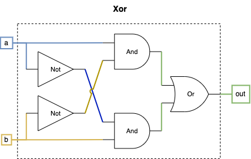
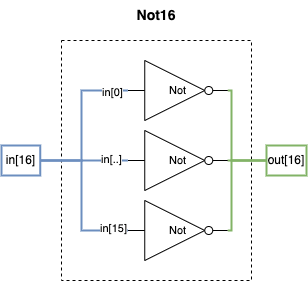
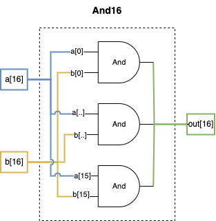
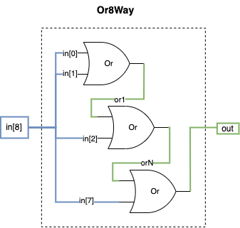
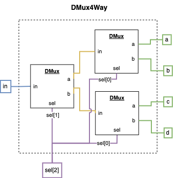
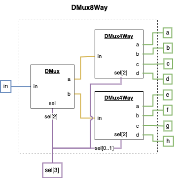

[Back](../README.md)

# Course 1 Project 1

Building the elementary logic gate chips from the humble Nand Gate.

## Nand - **_Provided by the Course_**

The Nand gate is used as the base for all the following logic because it has the property of "functional completeness" meaning that all functionality can be computed using nothing but Nand gates.

### Truth Table
| a   | b   | out |
| --- | --- | --- |
| 0   | 0   | 1   |
| 0   | 1   | 1   |
| 1   | 0   | 1   |
| 1   | 1   | 0   |

## And

Only emits 1 if both inputs are 1

### Truth Table
| a   | b   | out |
| --- | --- | --- |
| 0   | 0   | 0   |
| 0   | 1   | 0   |
| 1   | 0   | 0   |
| 1   | 1   | 1   |

### Diagram

Simply utilizes the identity property of the And portion of a Nand gate to invert the Nand result.

## Or

Emits 1 if either of the inputs are 1

### Truth Table
| a   | b   | out |
| --- | --- | --- |
| 0   | 0   | 0   |
| 0   | 1   | 1   |
| 1   | 0   | 1   |
| 1   | 1   | 1   |

### Diagram

For this diagram we look at the only scenario in the truth table where we get a 0 because it's easier to calculate than the 1's, and we invert the logic that would result in a 0.

## Xor - Exclusive Or

Emits 1 if the inputs are not the same

### Truth Table
| a   | b   | out |
| --- | --- | --- |
| 0   | 0   | 0   |
| 0   | 1   | 1   |
| 1   | 0   | 1   |
| 1   | 1   | 0   |

### Diagram

For this diagram, we combine the logic that would result in 1's as the output of our truth table.

## Mux - Multiplexer

The multiplexer accepts 2 inputs and uses a selector bit to decide which input should be sent to the output. If the selector is 0, then the output will match input a, otherwise the output will match input b.

### Diagram

## DMux - Demultiplexer

The demultiplexer accepts a single input and uses a selector bit to decide which output to send the input to. If the selector is 0, then the input will be routed to output a, otherwise it will be routed to output b. Non-selected outputs get the value 0.

### Diagram

## Not16

A bitwise not gate that receives a 16 bit input and inverts all the bits.

Example: `0000000011111111` becomes `1111111100000000`

### Diagram

This diagram uses spread syntax to avoid showing all 16 inverters.

## And16

A bitwise AND gate that receives two 16 bit inputs and runs each pair of bits through an AND gate.

### Diagram

This diagram uses spread syntax to avoid showing all 16 and gates.

## Or16

A bitwise OR gate that receives two 16 bit inputs and runs each pair of bits through an OR gate.

### Diagram

This diagram uses spread syntax to avoid showing all 16 or gates.

## Mux16

Operates just like a Mux gate except each input is 16 bits wide.

### Diagram

This diagram uses spread syntax to avoid showing all 16 mux gates.

## Or8Way

Takes in an input with 8 bits chains all bits using an OR gate. So if any of the bits are 1 then the output will be 1, but if ALL of the bits are 0 the output will be 0.

### Diagram

This diagram only shows 3 of the 7 required gates for simplicity.

## Mux4Way16

Takes in four 16-bit inputs and uses a 2-bit selector input to decide which input will be sent to the output.

### Diagram

## Mux8Way16

Takes in eight 16-bit inputs and uses a 3-bit selector input to decide which input will be sent to the output.

### Diagram

## DMux4Way

Takes in a single input and uses a 2-bit selector input to decide which of four outputs to route the input to.

### Diagram

## DMux8Way

Takes in a single input and uses a 3-bit selector input to decide which of eight outputs to route the input to.

### Diagram

