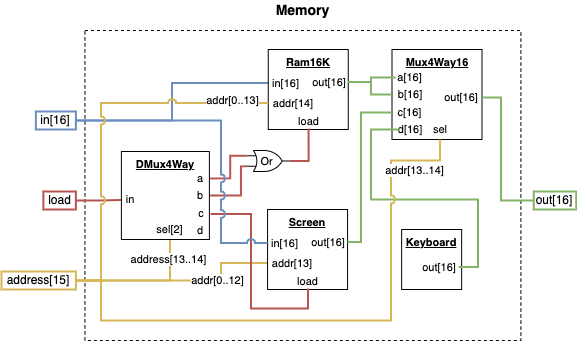
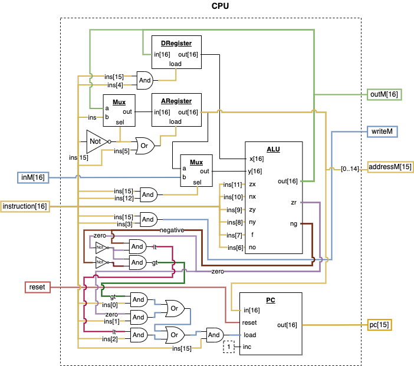
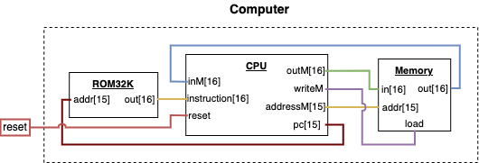

[Back](../README.md)

# Course 1 Project 5

Building the final chips that make up the entire Hack Computer.

## ROM32K - **_Provided by the Course_**

The `ROM32K` chip is simply a collection of RAM16K chips and receives a single 15 bit address as input and outputs the 16-bit value stored at that address. This chip is provided because of its simplicity, but also to enable to the Hardware Simulator to abstract the functionality of loading Hack Machine Code into the ROM.

## Memory

The Memory chip is a 32K size chip that consists of 3 parts. The first 16K registers are dedicated to data memory, the next 8K registers starting at address `16384` are dedicated to the screen memory map which uses a provided `Screen` chip, and the last part is the `Keyboard` register which is a read-only register that lives at address `24576`. The `Screen` chip is provided by the course and includes the functionality of linking to the Hardware simulator screen. The `Keyboard` chip is also provided by the course and will automatically output the value of whatever key is pressed in the hardware simulator.

### Diagram

## CPU

TODO: Describe this

### Diagram

TODO: add notes

## Computer

The computer chip simply connects the ROM, Memory, and CPU together into one unit and provides only a `reset` pin as an input. The reset pin is used to set the instruction to 0 which effectively restarts the program loaded into ROM.

### Diagram

