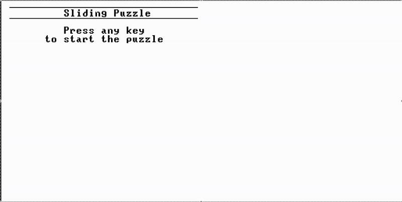
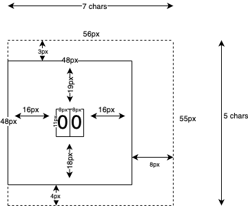

[Back](../README.md)

# Course 2 Project 9

Project 9 involves building an application in the Jack language to play around with its capabilities before building a compiler for the language.

# My Project - The Sliding Puzzle (15-puzzle) Game!!

I spent a bit of time looking around at some inspiration for a project and most of the games seemed just a bit too complicated for me to complete in any meaningful time (on my first attempt at least). So I started to think of relatively straightforward games that I have played either in virtual or physical formats and I settled on 15-puzzle which I used have as a nice little metal toy.

## Demo

The game starts with a prompt for a random key press which acts as the seed value to pick one of 30 pre-generated (solvable) puzzles. From there you can follow the on-screen instructions to win the game. This demo is recorded in real time.

## The Hurdles

### Rendering the tile using the built-in `Output` class

My desire was to be able to render all of the tiles using the built in output class so I wouldn't have to build my own font. This turned out to be quite difficult to wrap my head around. Basically the standard `Screen` rendering operations work within the constraints of "pixels", but the `Output` methods work within the constraints of character row and column counts.

My desire was to draw the tile box using lines and then to place the numeric text of the tile right in the center. The biggest challenge came from realizing that I had to position the box around the text instead of position the text within the box. To do this I determined that the dimensions of a single character:
- Character width: `8px`
- Character height: `11px`

I used 4 different sheets of scratch paper to try and come up with a solution but I ended up coming up with the following diagram that helped me generate the rendering logic:
- The `bounding box` (dotted line) of the tile is exactly 56px (7 characters) wide and 55px (5 characters) tall.
- The first of 2 characters is positioned 16px (2 characters) from the left side of the `bounding box`
- The characters are positioned 22px (2 characters) from the top of the `bounding box`
- The `tile border` (solid line) is the visible boundary of the tile and is exactly 48px wide and 48px tall.
- The `tile border` is left-aligned to the `bounding box` but the rest of the tile border is carefully positioned so the text appears in the center.

The `Tile` class in the Jack Language uses a `row` and `column` approach to help realize the rendering of the actual tile. The `bounding box` is already 8px wider and 7px taller than the visible `tile border` so this creates a natural padding between the tiles.
- The height of each `row` is the same as the `bounding box` height (55px).
- The width of each `column` (`col`) is the same as the `bounding box` width (56px).

### Discovering that not all 15-puzzles are even solvable

This one I discovered after I had a completely working project but I couldn't actually win the game the first couple attempts. My existing solution already depended on a system of pre-generated games using randomly shuffled ASCII strings that could then be converted into tile positions using the built-in `String.charAt(int num)` function. The issue was that some of my randomly shuffled strings couldn't be solved. The quick and dirtly solution was to generate a [helper script](./scripts/generate-solvable-puzzles.js) that uses an [algorithm](https://www.geeksforgeeks.org/check-instance-15-puzzle-solvable/) that I found to randomly generate puzzles that can actually be solved. As a bonus the script will generate the Jack code for me so that I can just copy and paste the puzzles.

To generate new puzzles you just need to run the following with node.js installed:

`node project9/scripts/generate-solvable-puzzles.js`